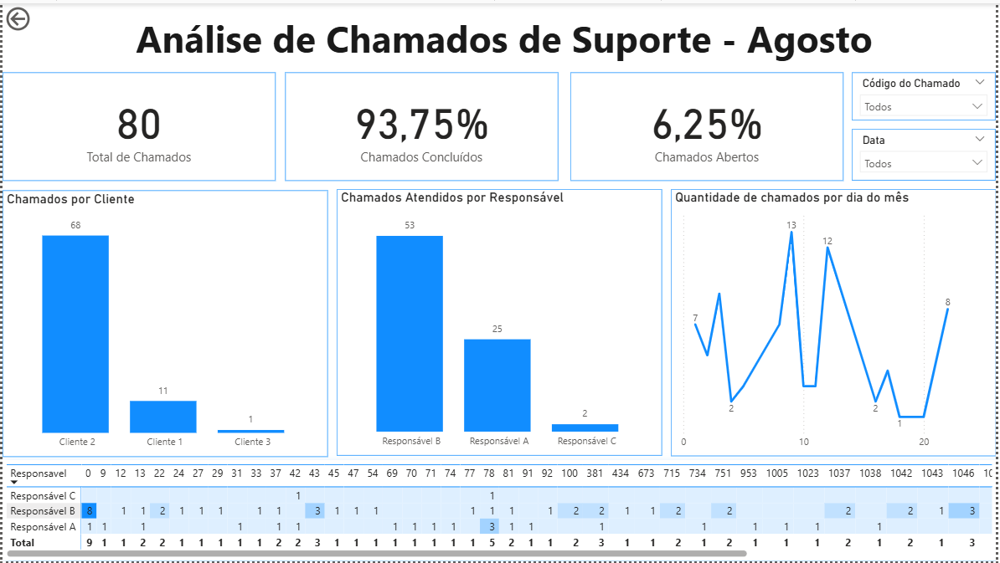

# 📈 Dashboard de Análise de Chamados (Empresa Anonimizada) - Power BI

## 🖼️ Prévia do Dashboard

Abaixo, é possível visualizar a interface final do dashboard.

 

---

## 🛡️ Aviso de Anonimização Total

Este projeto foi submetido a um processo completo de anonimização para proteger dados sensíveis e garantir a confidencialidade no portfólio.

* **Empresa:** O nome da empresa cliente foi **removido**.
* **Dados:** Nomes de clientes ("Cliente 1", "Cliente 2", etc.) e de responsáveis ("Responsável A", "B", "C") foram **substituídos por rótulos genéricos**.

## 🎯 Objetivo do Projeto

Case real, o objetivo inicial era atender a uma solicitação interna de suporte, focando na criação de visualizações essenciais para medir o volume de trabalho em **agosto**.

### Requisitos Mínimos (Pedido Original):

O relatório deveria responder a duas perguntas chave, usando a base de dados de chamados:

1.  **Quantidade de chamados por cliente no mês de agosto.**
2.  **Quantidade de chamados por “Responsável” no mês de agosto.**

### Entrega e Escopo Expandido:

Embora o pedido fosse simples, o projeto foi desenvolvido de forma mais robusta, incluindo **análises e visuais adicionais** para oferecer um produto mais completo e de maior valor (demonstrando a capacidade de ir além do solicitado).

## 🛠️ Detalhes Técnicos e Implementação

Este trabalho demonstra a habilidade de:

* **Tratamento de Dados (Power Query):** Conexão com fonte Excel e aplicação de transformações complexas, incluindo a lógica de anonimização (código M).
* **Modelagem de Dados:** Criação de um modelo eficiente para análise de BI.
* **Visualização:** Desenvolvimento de um dashboard funcional e de fácil leitura.

## 📁 Arquivos do Projeto

| Arquivo | Descrição |
| :--- | :--- |
| **`Dashboard Operacional.pbix`** | O arquivo principal do Power BI contendo o modelo, transformações e o layout do dashboard. |
| **`Base de Dados Operacional.xlsx`** | A fonte de dados original, já anonimizada e pronta para ser conectada. |

## 📊 Ferramentas Utilizadas

* **Ferramenta Principal:** Microsoft Power BI Desktop
* **Fonte de Dados:** Microsoft Excel
